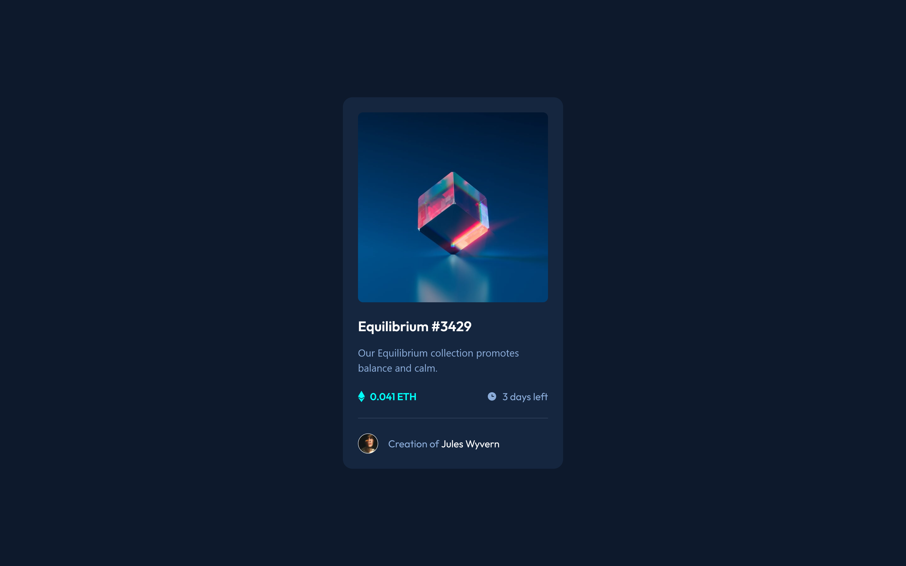

# Frontend Mentor - NFT preview card component solution

This is a solution to the [NFT preview card component challenge on Frontend Mentor](https://www.frontendmentor.io/challenges/nft-preview-card-component-SbdUL_w0U). Frontend Mentor challenges help you improve your coding skills by building realistic projects. 

## Table of contents

- [Overview](#overview)
  - [The challenge](#the-challenge)
  - [Screenshot](#screenshot)
  - [Links](#links)
- [My process](#my-process)
  - [Built with](#built-with)
  - [What I learned](#what-i-learned)
  - [Continued development](#continued-development)
  - [Useful resources](#useful-resources)
- [Author](#author)

## Overview

### The challenge

Users should be able to:

- View the optimal layout depending on their device's screen size
- See hover states for interactive elements

### Screenshot



### Links

- Solution URL: [Frontendmentor.io solution URL](https://fsdev-nft-preview-card-component.vercel.app/)
- Live Site URL: [Vercel live site URL](https://fsdev-nft-preview-card-component.vercel.app/)

## My process

### Built with

- Semantic HTML5 markup
- TailwindCSS
- Flexbox
- Mobile-first workflow
- [React](https://reactjs.org/) - JS library


### What I learned

Use this section to recap over some of your major learnings while working through this project. Writing these out and providing code samples of areas you want to highlight is a great way to reinforce your own knowledge.

To show an image when hovering over a background image using Tailwind CSS, you can use the group utility with hover states.
```html
 <article className="card-width rounded-card bg-Blue-900 p-6 flex flex-wrap justify-center items-center gap-6">
   <div className="group relative w-[302px] h-[302px] rounded-lg bg-[url(image-equilibrium.jpg)] bg-cover">
     <div className="absolute w-[302px] h-[302px] rounded-lg  group-hover:bg-Cyan-400/50 group-hover:cursor-pointer">
       
        </div>
      </div>
      ...
 </article>      
```

How to customize tailwindcss theme and using @utility and @apply directives.
```css
@import url('https://fonts.googleapis.com/css2?family=Outfit:wght@100..900&display=swap');
@import "tailwindcss";

@theme {
  --color-Blue-950: #0D192C;
  --color-Blue-900: #15263F;
  --color-Blue-800: #2E405A;
  --color-Blue-500: #8BACD9;
  --color-Cyan-400: #00fff8;

  --spacing-0: 0px;
  --spacing-100: 8px;
  --spacing-200: 16px;
  --spacing-300:24px;
 
  --radius-card: 15px;
}

@utility text-preset-1 {
  font-family: "Outfit", sans-serif;
  font-weight: 600;
  font-size: 22px;
  line-height: 125%;
  letter-spacing: 0px;
}

@utility text-preset-2 {
  font-family: "Outfit", sans-serif;
  font-weight: 300;
  font-size: 18px;
  line-height: 145%;
  letter-spacing: 0px;
}

@utility text-preset-3-semi {
  font-family: "Outfit", sans-serif;
  font-weight: 600;
  font-size: 16px;
  line-height: 125%;
  letter-spacing: 0px;
}


@utility text-preset-3-regular {
  font-family: "Outfit", sans-serif;
  font-weight: 400;
  font-size: 16px;
  line-height: 125%;
  letter-spacing: 0px;
}

@utility card-width {
  width: 350px;
}
```

### Continued development

Use this section to outline areas that you want to continue focusing on in future projects. These could be concepts you're still not completely comfortable with or techniques you found useful that you want to refine and perfect.

### Useful resources

- [TailwindCSS](https://tailwindcss.com/docs/installation/using-vite) - Tailwind CSS documentation

## Author

- Website - [Gustavo Sanchez ](https://gusanchefullstack.dev/)
- Frontend Mentor - [@gusanchefullstack](https://www.frontendmentor.io/profile/gusanchefullstack)
- Twitter - [@gusanchedev](https://x.com/gusanchedev)
- LinkedIn - [@gusanchefullstackdev](https://www.linkedin.com/in/gusanchefullstackdev/)


